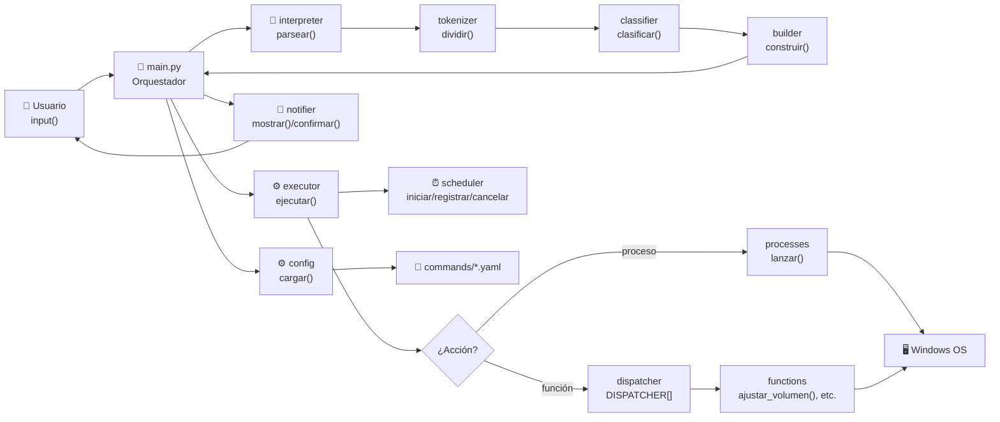
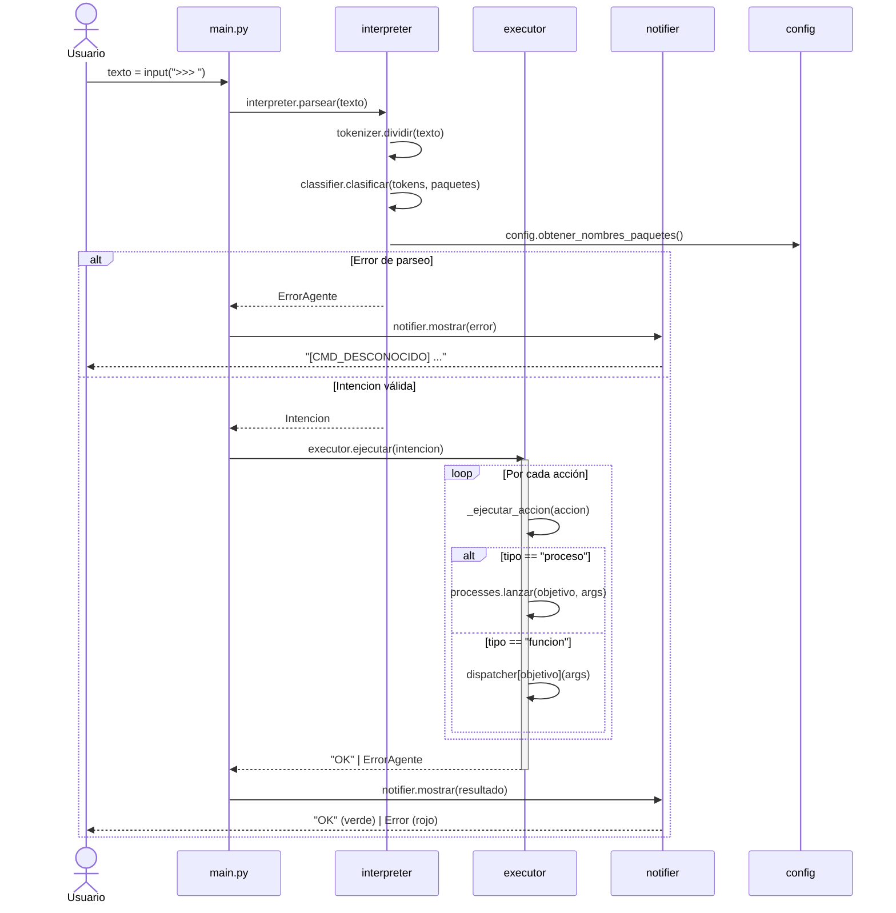

# Arquitectura del Agente

## Capas del sistema



También en formato texto como referencia rápida:

```
[Entrada]  →  [Interpreter]  →  [Executor]  →  [OS Windows]
                                     ↕
                               [Scheduler]
                                     ↕
                               [Notifier]  →  [Usuario]
                                     ↕
                                [Config]
```

## Flujo completo de ejecución



Texto del flujo:

```
1. Usuario escribe un comando en consola
2. main.py recibe el texto
3. main.py llama a interpreter.parsear(texto)
4. interpreter.tokenizer divide el texto en tokens
5. interpreter.classifier identifica tipo e intención
6. interpreter.builder construye el objeto Intencion
7. main.py recibe la Intencion y llama a executor.ejecutar(intencion)
8. executor itera las acciones del objeto Intencion
9. Por cada accion:
     si tipo == "proceso" → executor.processes lanza subprocess
     si tipo == "funcion" → executor.dispatcher llama función interna
10. Si alguna acción falla → construye ErrorAgente → retorna a main.py
11. main.py pasa resultado o error a notifier.mostrar()
12. notifier formatea y muestra al usuario
```

## Estructura de carpetas

```mermaid
graph TD
    ROOT["/agente-personal"] --> SPEC["spec/"]
    ROOT --> SRC["src/"]
    ROOT --> CMDS["commands/"]
    ROOT --> LOGS["logs/"]
    ROOT --> TESTS["tests/"]
    ROOT --> DOCS["docs/"]
    ROOT --> GH[".github/"]
    ROOT --> MAIN["main.py"]
    ROOT --> REQ["requirements.txt"]
    ROOT --> README["README.md"]
    ROOT --> CONTRIB["CONTRIBUTING.md"]
    ROOT --> CHG["CHANGELOG.md"]
    ROOT --> SEC["SECURITY.md"]

    SPEC --> S1["architecture.md"]
    SPEC --> S2["commands.md"]
    SPEC --> S3["modules.md"]
    SPEC --> S4["roadmap.md"]
    SPEC --> S5["cases.md"]

    SRC --> SRCI["interpreter/"]
    SRC --> SRCE["executor/"]
    SRC --> SRCS["scheduler/"]
    SRC --> SRCN["notifier/"]
    SRC --> SRCC["config/"]
    SRC --> MODELS["models.py"]

    SRCI --> I1["__init__.py"]
    SRCI --> I2["interpreter.py"]
    SRCI --> I3["tokenizer.py"]
    SRCI --> I4["classifier.py"]
    SRCI --> I5["builder.py"]

    SRCE --> E1["__init__.py"]
    SRCE --> E2["executor.py"]
    SRCE --> E3["dispatcher.py"]
    SRCE --> E4["functions.py"]
    SRCE --> E5["processes.py"]

    CMDS --> P1["primitives.yaml"]
    CMDS --> P2["packages.yaml"]

    DOCS --> D1["glossary.md"]
    DOCS --> D2["faq.md"]
    DOCS --> D3["troubleshooting.md"]
    DOCS --> D4["deployment.md"]
    DOCS --> D5["env-vars.md"]
    DOCS --> ADR["adr/"]

    GH --> GT1["ISSUE_TEMPLATE/"]
    GH --> GT2["PULL_REQUEST_TEMPLATE.md"]
```



Texto de la estructura:

```
/agente-personal
  /spec                        ← documentación de especificaciones
    README.md, architecture.md, commands.md, modules.md, roadmap.md, cases.md

  /src
    /interpreter               ← parsea y clasifica el comando
    /executor                  ← ejecuta acciones primitivas
    /scheduler                 ← gestiona tareas programadas
    /notifier                  ← maneja output al usuario
    /config                    ← lee y valida los YAML
    models.py                  ← contratos de datos

  /commands                    ← archivos YAML de paquetes y primitivas
    primitives.yaml, packages.yaml

  /docs                        ← documentación auxiliar
    glossary.md, faq.md, troubleshooting.md, deployment.md, env-vars.md
    /adr/                      ← Architecture Decision Records

  .github/                     ← templates de GitHub
    ISSUE_TEMPLATE/, PULL_REQUEST_TEMPLATE.md

  /logs                        ← registro de ejecuciones y errores
  /tests                       ← pruebas por módulo

  main.py                      ← orquestador, no ejecuta lógica
  requirements.txt
  README.md
  CONTRIBUTING.md
  CHANGELOG.md
  SECURITY.md
```

## Contratos de datos entre módulos

### Intencion
Objeto que `interpreter` entrega a `executor`.

```python
@dataclass
class Intencion:
    id: str                  # identificador del comando
    tipo: str                # "primitiva" | "paquete"
    ejecucion: str           # "instantanea" | "programada"
    schedule: dict | None    # {"hora": "08:00", "dias": ["lun"]} | None
    acciones: list[Accion]
```

### Accion
Unidad mínima ejecutable.

```python
@dataclass
class Accion:
    tipo: str        # "proceso" | "funcion"
    objetivo: str    # "firefox.exe" | "ajustar_volumen"
    args: list[str]  # parámetros en orden
```

### ErrorAgente
Objeto de error uniforme. Lo construye el módulo que detecta el fallo.

```python
@dataclass
class ErrorAgente:
    codigo: str       # ver catálogo en cases.md
    origen: str       # módulo que detectó el error
    detalle: str      # mensaje legible para el usuario
    accion: str|None  # acción que falló (si aplica)
```
