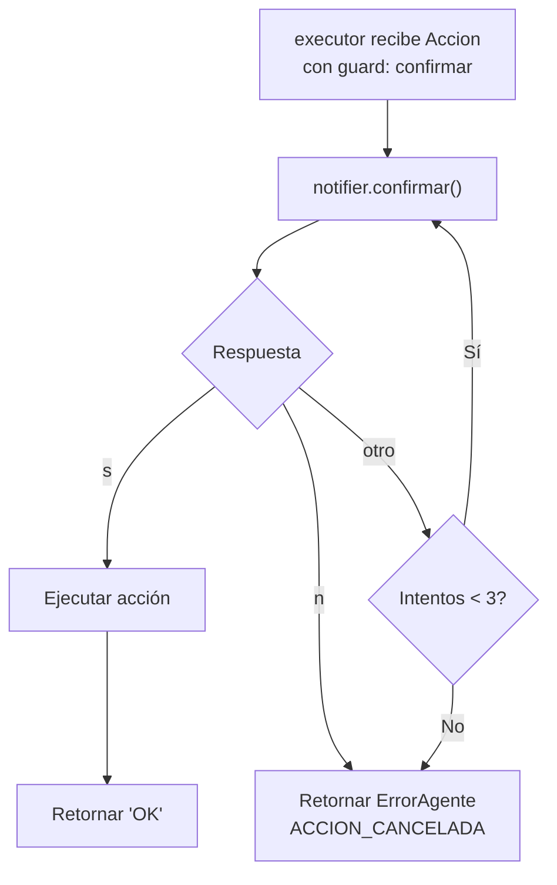

# Casos Borde y Catálogo de Errores

## Regla general

Todo error es un objeto `ErrorAgente`. El módulo que detecta el fallo lo construye
y lo retorna. Nunca imprime directamente. `notifier` es quien lo muestra al usuario.

## Catálogo de errores

### CMD_VACIO
```
origen:  interpreter / classifier o builder
cuándo:  el usuario presiona enter sin escribir nada
detalle: "No escribiste ningún comando."
accion:  None
```

### CMD_DESCONOCIDO
```
origen:  interpreter / classifier  |  interpreter / builder
cuándo:  tokens[0] no está en VERBOS ni en NOMBRES_PAQUETES
         O la primitiva no está definida en YAML
         O el paquete no se encuentra en config.obtener_paquetes()
detalle: "El comando '{token}' no existe."
         "Primitiva '{id}' no definida en YAML."
         "Paquete '{frase}' no encontrado."
accion:  None
```

### PARAM_INVALIDO
```
origen:  interpreter / builder
cuándo:  un parámetro no cumple el tipo o rango esperado
         ej: ajustar_volumen con nivel = "alto" en vez de 0-100
detalle: "El parámetro '{param}' no es válido para '{comando}'."
accion:  id del comando
```

### RUTA_INVALIDA
```
origen:  executor / processes o functions
cuándo:  una ruta de archivo o directorio no existe en el sistema
detalle: "La ruta '{ruta}' no existe o no es accesible."
accion:  id de la acción fallida
```

### APP_NO_ENCONTRADA
```
origen:  executor / processes
cuándo:  el ejecutable no está instalado o no está en el PATH
detalle: "La aplicación '{app}' no está instalada o la ruta es incorrecta."
accion:  id de la acción fallida
```

### ERROR_APP
```
origen:  executor / processes
cuándo:  la app se inició pero retornó un código de error
detalle: "La aplicación '{app}' se inició pero reportó un error."
accion:  id de la acción fallida
```

### ACCION_CANCELADA
```
origen:  executor
cuándo:  el usuario responde "n" en un comando con guard: confirmar,
         o agota los 3 intentos disponibles en notifier.confirmar()
         El executor detecta accion.confirmacion == True y delega
         en notifier.confirmar() antes de ejecutar.
detalle: "Acción cancelada por el usuario."
accion:  id de la acción cancelada
```

## Comportamiento ante errores en paquetes

Si una acción dentro de un paquete genera cualquier `ErrorAgente`:
1. Se detiene la ejecución del paquete completo (fail-fast).
2. No se ejecutan las acciones siguientes.
3. Se retorna el `ErrorAgente` con la acción exacta donde falló.
4. `notifier` muestra el error al usuario.

## Flujo de un comando destructivo



Texto del flujo:

```
executor recibe Accion con guard: confirmar
  → notifier.confirmar("¿Eliminar C:/archivo.txt? [s/n]")
  → si "s": ejecutar eliminación → retornar "OK"
  → si "n": retornar ErrorAgente(ACCION_CANCELADA)
  → si otro input: volver a preguntar (máximo 3 intentos)
  → si 3 intentos sin respuesta válida: retornar ErrorAgente(ACCION_CANCELADA)
```

## Restricción: comandos destructivos en paquetes

Los comandos con `guard: confirmar` pueden estar dentro de un paquete,
pero interrumpen el flujo y esperan decisión humana antes de continuar.
Si el usuario cancela, el paquete completo se detiene desde ese punto.
