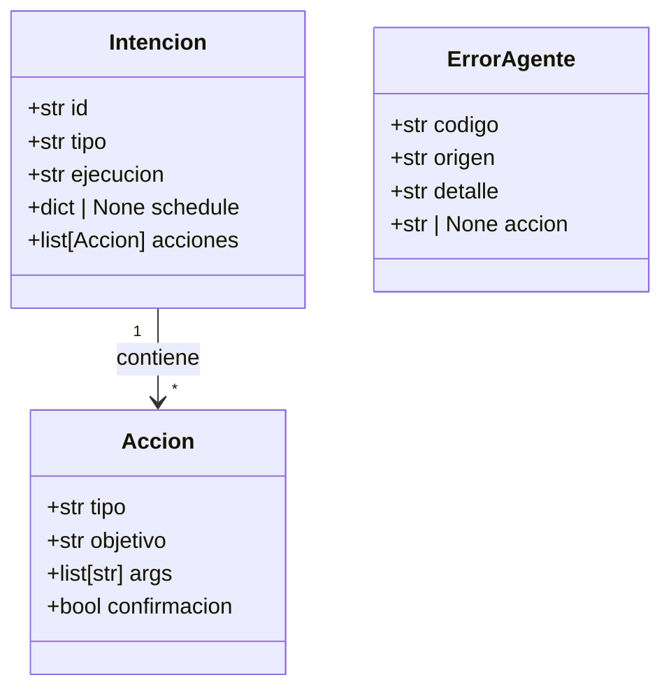

# Definición de Módulos

## Diagrama de clases (modelos de datos)



## main.py — Orquestador

Coordina el flujo completo. No ejecuta lógica de negocio.

**Responsabilidades:**
- Iniciar el agente (cargar config, iniciar scheduler)
- Recibir input del usuario en loop
- Pasar texto a `interpreter`
- Pasar `Intencion` a `executor`
- Pasar resultado o `ErrorAgente` a `notifier`

**Nunca hace:**
- `import subprocess`
- `import yaml`
- Lógica condicional sobre tipos de comandos
- Output directo al usuario

**Pseudocódigo:**
```
iniciar:
  config.cargar()
  scheduler.iniciar()

loop:
  texto = input()
  intencion = interpreter.parsear(texto)
  resultado = executor.ejecutar(intencion)
  notifier.mostrar(resultado)
```

---

## /interpreter

Recibe texto crudo. Devuelve un objeto `Intencion`. No sabe nada del OS.

### interpreter.py
Punto de entrada del módulo. Coordina tokenizer, classifier y builder.

```python
def parsear(texto: str) -> Intencion | ErrorAgente:
    tokens     = tokenizer.dividir(texto)
    nombres    = config.obtener_nombres_paquetes()
    tipo, ejec = classifier.clasificar(tokens, nombres, texto)
    intencion  = builder.construir(tokens, tipo, ejec)
    return intencion
```

### tokenizer.py
Divide el texto en tokens usando `shlex.split()`, que respeta comillas
simples y dobles. Si el parseo falla (comillas sin cerrar), cae a
`str.split()`.

```python
def dividir(texto: str) -> list[str]
# entrada:  'abrir "C:/Program Files/Chrome/chrome.exe" https://youtube.com'
# salida:   ["abrir", "C:/Program Files/Chrome/chrome.exe", "https://youtube.com"]
```

### classifier.py
Identifica si el comando es primitiva o paquete, e instantáneo o programado.
Consulta `VERBOS`, los ids de paquetes y, como **fallback**, envía el texto
a un LLM local (Ollama) para interpretación en lenguaje natural.

Si el LLM traduce exitosamente, los tokens se reemplazan con la
traducción y se retorna `("primitiva", "instantanea")`.

```python
def clasificar(tokens: list[str], nombres_paquetes: set[str], texto_original: str = "") -> tuple[str, str]
# 1. tokens vacío                        → ErrorAgente(CMD_VACIO)
# 2. tokens[0] == PREFIJO_PAQUETE        → paquete por id
# 3. " ".join(tokens) en ids_paquetes    → paquete (compatibilidad)
# 4. tokens[0] en VERBOS["es"]           → primitiva
# 5. texto_original → LLM (Ollama)       → primitiva si reconoce
# 6. ningún caso                         → ErrorAgente(CMD_DESCONOCIDO)
```

### builder.py
Construye el objeto `Intencion` a partir de los tokens clasificados.

Si `tipo == "paquete"` tiene una rama temprana que recupera la
definición del paquete desde `config.obtener_paquetes()` y construye
todas las `Accion` sin pasar por la lógica de primitivas.

Si `tipo == "primitiva"` resuelve el verbo, desambigua si es necesario
(consultar → sistema/web, ajustar → volumen/brillo, programar →
alarma/recordatorio), y pasa el campo `guard` del YAML como
`confirmacion` a la `Accion`.

```python
def construir(tokens: list[str], tipo: str, ejecucion: str) -> Intencion | ErrorAgente
# si tipo == "paquete":
#   id_busqueda = " ".join(tokens[1:])   ← salta PREFIJO_PAQUETE
#   paquete = config.obtener_paquetes()[id_busqueda]
#   acciones = [Accion(...) for accion_yaml in paquete.acciones]
#   return Intencion(id, tipo, ejecucion, acciones)
#
# si tipo == "primitiva":
#   id = VERBOS_A_PRIMITIVA[tokens[0]]
#   si id es None → desambiguar con tokens[1]
#   confirmacion = (primitiva.guard == "confirmar")
#   return Intencion(id, tipo, ejecucion, [Accion(..., confirmacion)])
```

---

## /executor

Recibe un objeto `Intencion`. Ejecuta cada `Accion` en orden. Aplica fail-fast.

### executor.py
Itera las acciones. Detiene en el primer error.
Antes de ejecutar cualquier acción, si `accion.confirmacion` es
`True`, delega en `notifier.confirmar()`; si el usuario cancela,
retorna `ACCION_CANCELADA` sin ejecutar.

```python
def ejecutar(intencion: Intencion) -> str | ErrorAgente:
    for accion in intencion.acciones:
        resultado = _ejecutar_accion(accion)
        logger.registrar(resultado, accion.objetivo)
        if isinstance(resultado, ErrorAgente):
            return resultado
    return "OK"

def _ejecutar_accion(accion: Accion) -> str | ErrorAgente:
    if accion.confirmacion:
        if not notifier.confirmar(f"¿Confirmas ejecutar '{accion.objetivo}'?"):
            return ErrorAgente(ACCION_CANCELADA, ...)
    if accion.tipo == "proceso":
        return processes.lanzar(accion.objetivo, accion.args)
    if accion.tipo == "funcion":
        return dispatcher.DISPATCHER[accion.objetivo](accion.args)
```

### dispatcher.py
Diccionario que mapea nombre de función → función interna.
Importa de `processes.py` y `functions.py`.

```python
DISPATCHER = {
    "ajustar_volumen":   functions.ajustar_volumen,
    "subir_volumen":     functions.subir_volumen,
    "bajar_volumen":     functions.bajar_volumen,
    "ajustar_brillo":    functions.ajustar_brillo,
    "consultar_sistema": functions.consultar_sistema,
    "cerrar_proceso":    functions.cerrar_proceso,
    "listar_procesos":   functions.listar_procesos,
    "mover_archivo":     functions.mover_archivo,
    "crear_archivo":     functions.crear_archivo,
    "eliminar_archivo":  functions.eliminar_archivo,
    "programar_alarma":  functions.programar_alarma,
    "programar_recordatorio": functions.programar_recordatorio,
    "esperar":           functions.esperar,
    "notificar":         functions.notificar,
    "consultar_web":     functions.consultar_web,
}
```

### processes.py
Lanza ejecutables externos con `subprocess`.
Si el objetivo contiene "firefox" y hay argumentos, inserta
automáticamente `--new-tab` antes de los args.

```python
def lanzar(objetivo: str, args: list[str]) -> str | ErrorAgente
# "firefox" en objetivo + args → ["firefox.exe", "--new-tab", "url"]
```

### functions.py
Implementa todas las funciones internas del agente.
Cada función retorna `str` en éxito o `ErrorAgente` en fallo.

Funciones implementadas actualmente:
- `ajustar_volumen` — vía `pycaw` (rango 0-100).
- `subir_volumen` — suma 20% al nivel actual vía `pycaw`.
- `bajar_volumen` — resta 20% al nivel actual vía `pycaw`.
- `ajustar_brillo` — vía `screen_brightness_control` (rango 0-100).
- `consultar_sistema` — vía `psutil` (ram, cpu, batería, red). Muestra resultado con `notifier`.
- `cerrar_proceso` — vía `psutil.process_iter` + `terminate()`.
- `listar_procesos` — vía `psutil.process_iter`, muestra PID y nombre con `notifier`.
- `mover_archivo` — vía `shutil.move()` (origen → destino).
- `crear_archivo` — vía `pathlib.Path.touch()`, crea directorios padre automáticamente.
- `eliminar_archivo` — `os.remove()` con manejo de `FileNotFoundError`.
  Funciona junto con la guard clause en executor: el YAML define
  `guard: confirmar`, builder lo convierte en `confirmacion=True`,
  y executor pide confirmación antes de llamar a `os.remove`.
- `notificar` — toast de Windows con `winotify`.
- `esperar` — `time.sleep(N)`.
- `programar_alarma` — vía `APScheduler` con trigger cron a una hora específica.
- `programar_recordatorio` — vía `APScheduler` con trigger cron recurrente
  (`day_of_week`). Acepta días en español (lun,mar,mie,...).

Funciones pendientes (stub): `consultar_web`.

---

## /logger

Sistema de logs que registra cada acción ejecutada en ``/logs/agente.log``.
Usa el módulo estándar ``logging``. Es llamado desde ``executor`` después
de cada ``_ejecutar_accion()``, tanto en éxito como en error.

```python
def registrar(resultado: str | ErrorAgente, accion: str) -> None
# formato: [2024-01-15 09:15:00] [INFO] OK - abrir_proceso
# formato: [2024-01-15 09:15:01] [ERROR] executor/functions - APP_NO_ENCONTRADA: firefox.exe
```

---

## /llm

Módulo de interpretación de lenguaje natural vía Ollama.
Actúa como **fallback** del classifier: cuando ningún verbo
registrado ni id de paquete coincide, envía el texto original
a un modelo local (`qwen2.5:0.5b` o `llama3.2:3b`) y traduce
la intención al formato de comandos del agente.

```python
def interpretar(texto: str) -> str
# retorna: comando traducido ("abrir firefox.exe") o "desconocido"
```

---

## /scheduler

Registra y dispara tareas programadas con `APScheduler`.
La instancia única de `BackgroundScheduler` se exporta vía
`obtener_scheduler()` para que `functions.py` pueda agregar jobs
directamente desde `programar_alarma` y `programar_recordatorio`.

```python
def iniciar() -> None
def registrar(intencion: Intencion) -> None  # preparado para uso futuro
def cancelar(id: str) -> None
def obtener_scheduler() -> BackgroundScheduler  # exporta la instancia única
```

---

## /notifier

Toda salida al usuario pasa por aquí. Formatea texto con `rich`.

```python
def mostrar(resultado: str | ErrorAgente) -> None
def confirmar(mensaje: str) -> bool   # para comandos destructivos
```

---

## /config

Carga los YAML una vez al iniciar. Indexa los paquetes por
``id`` (``_paquetes_por_id``) en vez de por palabras clave.
Nadie más lee archivos YAML directamente.

```python
def cargar() -> None
def obtener_paquetes() -> dict
def obtener_nombres_paquetes() -> set[str]
def obtener_primitiva(id: str) -> dict | None
```

**Nota:** Los YAML son de solo lectura durante una sesión activa.
Para editar paquetes mientras el agente corre, se implementará
`recargar_config()` en Fase 2.
