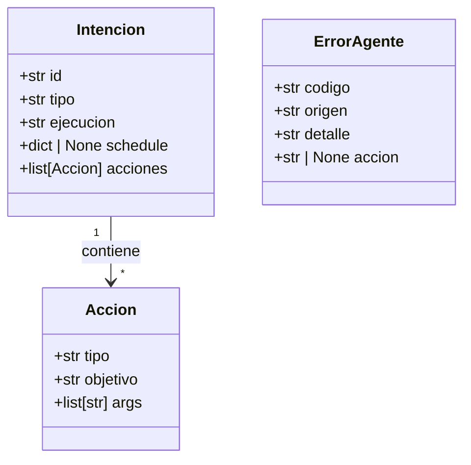

# Definición de Módulos

## Diagrama de clases (modelos de datos)



## main.py — Orquestador

Coordina el flujo completo. No ejecuta lógica de negocio.

**Responsabilidades:**
- Iniciar el agente (cargar config, iniciar scheduler)
- Recibir input del usuario en loop
- Pasar texto a `interpreter`
- Pasar `Intencion` a `executor`
- Pasar resultado o `ErrorAgente` a `notifier`

**Nunca hace:**
- `import subprocess`
- `import yaml`
- Lógica condicional sobre tipos de comandos
- Output directo al usuario

**Pseudocódigo:**
```
iniciar:
  config.cargar()
  scheduler.iniciar()

loop:
  texto = input()
  intencion = interpreter.parsear(texto)
  resultado = executor.ejecutar(intencion)
  notifier.mostrar(resultado)
```

---

## /interpreter

Recibe texto crudo. Devuelve un objeto `Intencion`. No sabe nada del OS.

### interpreter.py
Punto de entrada del módulo. Coordina tokenizer, classifier y builder.

```python
def parsear(texto: str) -> Intencion | ErrorAgente:
    tokens     = tokenizer.dividir(texto)
    tipo, ejec = classifier.clasificar(tokens)
    intencion  = builder.construir(tokens, tipo, ejec)
    return intencion
```

### tokenizer.py
Divide el texto en tokens (lista de strings).

```python
def dividir(texto: str) -> list[str]
# entrada:  "abrir firefox https://notion.so"
# salida:   ["abrir", "firefox", "https://notion.so"]
```

### classifier.py
Identifica si el comando es primitiva o paquete, e instantáneo o programado.
Consulta `VERBOS` y los nombres de paquetes cargados en memoria por `config`.

```python
def clasificar(tokens: list[str]) -> tuple[str, str]
# retorna: ("primitiva" | "paquete", "instantanea" | "programada")
# si tokens[0] en VERBOS["es"]    → primitiva
# si tokens[0] en NOMBRES_PAQUETES → paquete
# si ninguno                       → ErrorAgente(CMD_DESCONOCIDO)
```

### builder.py
Construye el objeto `Intencion` a partir de los tokens clasificados.

```python
def construir(tokens: list[str], tipo: str, ejecucion: str) -> Intencion
```

---

## /executor

Recibe un objeto `Intencion`. Ejecuta cada `Accion` en orden. Aplica fail-fast.

### executor.py
Itera las acciones. Detiene en el primer error.

```python
def ejecutar(intencion: Intencion) -> str | ErrorAgente:
    for accion in intencion.acciones:
        resultado = _ejecutar_accion(accion)
        if isinstance(resultado, ErrorAgente):
            return resultado
    return "OK"

def _ejecutar_accion(accion: Accion) -> str | ErrorAgente:
    if accion.tipo == "proceso":
        return processes.lanzar(accion.objetivo, accion.args)
    if accion.tipo == "funcion":
        return dispatcher.DISPATCHER[accion.objetivo](accion.args)
```

### dispatcher.py
Diccionario que mapea nombre de función → función interna.
Importa de `processes.py` y `functions.py`.

```python
DISPATCHER = {
    "ajustar_volumen":   functions.ajustar_volumen,
    "ajustar_brillo":    functions.ajustar_brillo,
    "consultar_sistema": functions.consultar_sistema,
    "cerrar_proceso":    functions.cerrar_proceso,
    "listar_procesos":   functions.listar_procesos,
    "mover_archivo":     functions.mover_archivo,
    "crear_archivo":     functions.crear_archivo,
    "eliminar_archivo":  functions.eliminar_archivo,
    "programar_alarma":  functions.programar_alarma,
    "programar_recordatorio": functions.programar_recordatorio,
    "esperar":           functions.esperar,
    "notificar":         functions.notificar,
    "consultar_web":     functions.consultar_web,
}
```

### processes.py
Lanza ejecutables externos con `subprocess`.

```python
def lanzar(objetivo: str, args: list[str]) -> str | ErrorAgente
```

### functions.py
Implementa todas las funciones internas del agente.
Cada función retorna `str` en éxito o `ErrorAgente` en fallo.

---

## /scheduler

Registra y dispara tareas programadas con `APScheduler`.

```python
def iniciar() -> None
def registrar(intencion: Intencion) -> None
def cancelar(id: str) -> None
```

---

## /notifier

Toda salida al usuario pasa por aquí. Formatea texto con `rich`.

```python
def mostrar(resultado: str | ErrorAgente) -> None
def confirmar(mensaje: str) -> bool   # para comandos destructivos
```

---

## /config

Carga los YAML una vez al iniciar. Los deja en memoria para toda la sesión.
Nadie más lee archivos YAML directamente.

```python
def cargar() -> None
def obtener_paquetes() -> dict
def obtener_nombres_paquetes() -> set[str]
def obtener_primitiva(id: str) -> dict | None
```

**Nota:** Los YAML son de solo lectura durante una sesión activa.
Para editar paquetes mientras el agente corre, se implementará
`recargar_config()` en Fase 2.
